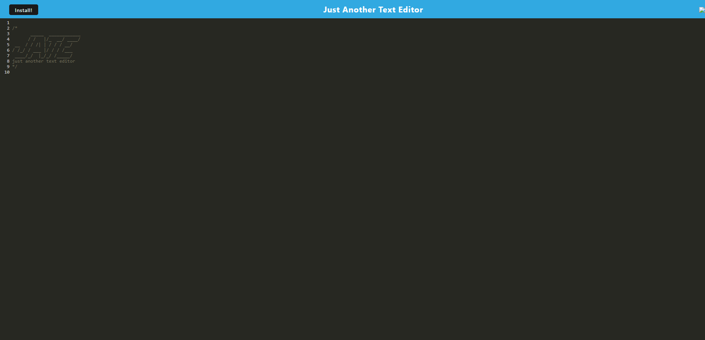

# PWA Text Editor
This project is a text editor built using Progressive Web Application (PWA) technologies, which means it can be installed on a user's device and used offline. The app is a single-page application that features data persistence techniques using IndexedDB as a lightweight database.

## User Story
As a developer, I want to create notes or code snippets with or without an internet connection so that I can reliably retrieve them for later use.

## Getting Started
To get started with this project, clone the repository and run the following commands:
```
npm install
npm run start
```
This will start the backend and serve the client on http://localhost:3000.

## Technologies Used
- Progressive Web Application (PWA) technologies
- IndexedDB
- idb package
- Heroku
- Workbox
- Webpack

## Usage


## Links
[GitHub Repo](https://github.com/Ale-Miret/text-editor)

[Deployed Page](https://frozen-falls-99998.herokuapp.com/)